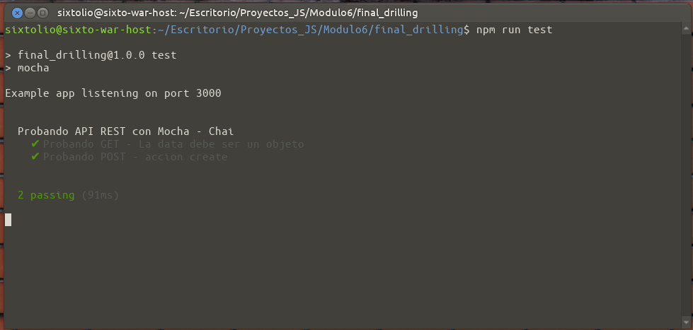

# Final Drilling M6
## Animación Japonesa

Repositorio Publico: https://github.com/sixtoguerra1982/final_drilling_m6

## END POINTS


| METHOD | END PONT | DESCRIPTION |
| ------ | ------   | ---------|
| get | / | Ruta raiz, via HTML/Fetch se despliega la informacion entregada por el endopoit **/api/v1/anime**  | 
| get | /api/v1/anime | Entrega JSON con listado general de comics. |
| get | /api/v1/anime/:id | Busqueda de comic, en funcion de su ID. |
| get | /api/v1/anime/nombre/:nombre | Busqueda de comic, en funcion de su NOMBRE | 
| post | /api/v1/anime | CREATE |
| put | /api/v1/anime/:id | UPDATE |
| delete | /api/v1/anime/:id | DELETE |

## JSON DE CREACION Y/O MODIFICACION.


```sh
* ENVIAR BODY JSON CONTENT -> Ejemplo:
{
  "nombre": "Super Campeones",
  "genero": "Futbol",
  "año": "1982",
  "autor": "Oliver"
}
```
<a href="./END POINTS.postman_collection.json" target="blank" >Postman_Collection</a>

## TEST
</img>

## Estudiante
**Sixto Felipe Guerra Urbina**